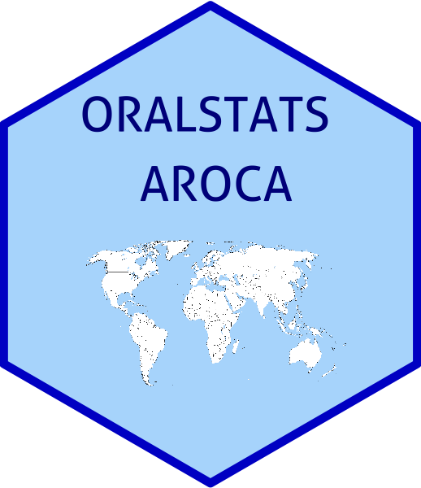

 

# Description

Oralstats Aroca is a simplification of the main features of Oralstats (Cabedo 2021). The basic aim is to allow researchers to query and download data from Ameresco Speech Oral Corpus (Albelda and Estellés, online, and freely available at www.corpusameresco.com).

# Online version

You can see the script working with Ameresco Corpus at the following link:

https://adrin-cabedo.shinyapps.io/aroca_viewer/

# Citation

Cabedo, A. & Carcelén, A. (2021). Oralstats Aroca. Version beta 1.2. Available online at [https://github.com/acabedo/aroca](https://github.com/acabedo/aroca)

# Requirements

1. Basic knowledge of R (and specifically Shiny)
2. Basic knowledge of SQL language.
3. SQL database (PostgreSQL, SQlite, MySQL...).
4. Optional (but recommended): data processed and converted with Oralstats transformation module.

# Contact

Any doubt or suggestion? Just contact us: adrian.cabedo@uv.es / andrea.carcelen@uv.es

# License

GNU General Public License v3.0 Permissions of this strong copyleft license are conditioned on making available complete source code of licensed works and modifications, which include larger works using a licensed work, under the same license. Copyright and license notices must be preserved. Contributors provide an express grant of patent rights.
